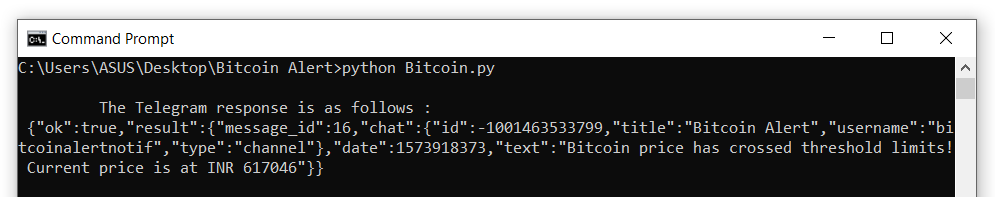

# Crypto-Alert

## Sends Telegram alerts based on cryptocurrency price fluctuations.

<div align="center">
    
</div>

This project uses APIs from cryptocompare.com and the Telegram application to send alerts whenever the Bitcoin price (in INR) suddenly spikes (using Z-score analysis)



## Using Crypto-alert

>From the command line, execute the following commands:

```bash
# Clone this repository
$ git clone https://github.com/Soumik-Dhar/Crypto-Alert.git
```
```bash
# Go into the repository
$ cd Crypto-Alert
```

### Instructions for using the module:

1. Rename the "sample-conf.py" file in the code folder to "conf.py"
2. In the conf.py file, replace CHAT_ID and BOT_ID with your channel's respective ids.
3. Follow the instructions for telegram app to get your CHAT_ID and BOT_ID

### Instructions for setting up the Telegram app:

1. Download the "telegram" app from google play store.
2. Open telegram app and from the menu options select "new channel" option.
3. Give a suitable channel name (say testChannel) and proceed.
4. Select the "public channel" option and provide input for the link (say t.me/testChannelLink1234) and proceed. You now have a channel.
5. Now in the search bar search for "BotFather".
6. Now first type "/start" and send the message, then type "/newbot" and send message.
7. Now follow instructions and give appropriate input.
8. You should have a bot name and the HTTP API key generated by now.
9. Now go to the channel that you created (i.e. testChannel) and select the "Administrators" option and then click on "Add Admin".
10. Now search for the name of the bot that you just created in BotFather and select it.
11. Select all priviledes for the bot except the "Add New Admin" privedge and proceed.

### Replace the following in the conf.py as follows:

* CHAT_ID = @+channel permanent link name ( like - @testChannelLink1234 )
* BOT_ID = bot+http api key (like - bot987637509:AAF5dQ8kbpVx4kKtd_Tn2cS1gFIxBrKYxF8)

>From the terminal, execute the following commands:

```bash
# Execute python script
$ python Bitcoin.py
```
Let the module compute the z-scores after getting 10 data points and see the updates arriving on your Telegram channel with the latest Bitcoin prices!
